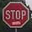
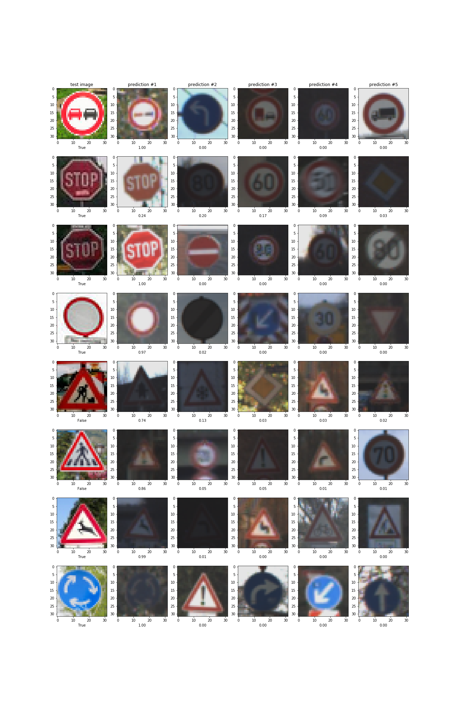

# **Traffic Sign Recognition** 

**Build a Traffic Sign Recognition Project**

The goals / steps of this project are the following:
* Load the data set (see below for links to the project data set)
* Explore, summarize and visualize the data set
* Design, train and test a model architecture
* Use the model to make predictions on new images
* Analyze the softmax probabilities of the new images
* Summarize the results with a written report

[//]: # (Image References)

[image1]: ./examples/visualization.jpg "Visualization"
[image2]: ./examples/grayscale.jpg "Grayscaling"
[image3]: ./examples/random_noise.jpg "Random Noise"
[image4]: ./examples/placeholder.png "Traffic Sign 1"
[image5]: ./examples/placeholder.png "Traffic Sign 2"
[image6]: ./examples/placeholder.png "Traffic Sign 3"
[image7]: ./examples/placeholder.png "Traffic Sign 4"
[image8]: ./examples/placeholder.png "Traffic Sign 5"

## Rubric Points
Here I will consider the [rubric points](https://review.udacity.com/#!/rubrics/481/view) individually and describe how I addressed each point in my implementation.  

### Data Set Summary & Exploration

#### 1. Provide a basic summary of the data set and identify where in your code the summary was done. In the code, the analysis should be done using python, numpy and/or pandas methods rather than hardcoding results manually.

The code for this step is contained in the **code cell 1** of the IPython notebook.  

I used the pandas library to calculate summary statistics of the traffic
signs data set:

* The size of training set is 34799
* The size of test set is 12630
* The shape of a traffic sign image is 32x32 (3 color channels)
* The number of unique classes/labels in the data set is 43

#### 2. Include an exploratory visualization of the dataset and identify where the code is in your code file.

The code for this step is contained in the **code cells 4 and 5** of the IPython notebook.  

Here is an exploratory visualization of the data set. It is a bar chart showing how the data is distributed over the 43 classes.

![alt text][train_hist.png]

It's clear that there is a high class imbalance, where the number of some classes is well above the expected average per class (dotted black line) and others are well below.

I also plotted a bunch of images from the training set. The images are quite small and many are hard to read even for me.

### Design and Test a Model Architecture

#### 1. Describe how, and identify where in your code, you preprocessed the image data. What tecniques were chosen and why did you choose these techniques? Consider including images showing the output of each preprocessing technique. Pre-processing refers to techniques such as converting to grayscale, normalization, etc.

The code for this step is contained in the **code cells 6 and 7** of the IPython notebook.

As a first step, I just normalized the data and continued on playing with the model. Later on I tried adding a grayscale layer to the input but this actually lowered the validation accuracy.

#### 2. Describe how, and identify where in your code, you set up training, validation and testing data. How much data was in each set? Explain what techniques were used to split the data into these sets. (OPTIONAL: As described in the "Stand Out Suggestions" part of the rubric, if you generated additional data for training, describe why you decided to generate additional data, how you generated the data, identify where in your code, and provide example images of the additional data)

The data was already split into training, validation and test sets, so it doesn't really apply here.

The only augmentation I tried was adding a grayscale channel to the input data, but this actually decreased the validation accuracy.

#### 3. Describe, and identify where in your code, what your final model architecture looks like including model type, layers, layer sizes, connectivity, etc.) Consider including a diagram and/or table describing the final model.

The code for my final model is located in **code cell 10** of the ipython notebook. I discovered a Tensorflow module (tensorflow.contrib.slim) that greatly simplifies the process of coding models and used that instead of the vanilla way of doing it.

My final model is a convolutonal network. The convolutional part consists of several consecutive convolutions with decreasing output size and inceasing number of features. I only used 1 pooling layer, since I prefered to use VALID padding to decrease the size most of the time. All convolutions have a 5x5 kernel and a ReLU activation.

After flattening, I used a rather wide fully connected layer, followed by a ReLU activation and dropout with a keep probability of 0.5. I kept halving the number of neurons until I got to 512 (also with ReLU and dropout). After that, I had 2 more fully connected layers with ReLU and the final logits layer with #neurons = #classes.

My final model consisted of the following layers:

| Layer         		|     Description	        					| 
|:---------------------:|:---------------------------------------------:| 
| Input         		| 32x32x3 RGB image   							| 
| Convolution 5x5     	| 1x1 stride, VALID padding, outputs 28x28x6 	|
| RELU					|												|
| Convolution 5x5     	| 1x1 stride, VALID padding, outputs 24x24x12 	|
| RELU					|												|
| Convolution 5x5     	| 1x1 stride, SAME padding, outputs 24x24x20 	|
| RELU					|												|
| Convolution 5x5     	| 1x1 stride, SAME padding, outputs 24x24x28 	|
| RELU					|												|
| Max pooling	      	| 2x2 stride,  outputs 12x12x28 				|
| Convolution 5x5     	| 1x1 stride, VALID padding, outputs 8x8x36 	|
| RELU					|												|
| Flatten				|												|
| Fully connected		|	4096										|
| RELU					|												|
| Dropout				|	0.5											|
| Fully connected		|	2048										|
| RELU					|												|
| Dropout				|	0.5											|
| Fully connected		|	1024										|
| RELU					|												|
| Dropout				|	0.5											|
| Fully connected		|	512											|
| RELU					|												|
| Dropout				|	0.5											|
| Fully connected		|	120											|
| RELU					|												|
| Fully connected		|	84											|
| RELU					|												|
| Fully connected		|	43											|
| Softmax				| etc.        									|
|						|												|
 

#### 4. Describe how, and identify where in your code, you trained your model. The discussion can include the type of optimizer, the batch size, number of epochs and any hyperparameters such as learning rate.

The code for training the model is located in the **code cells 12, 13 and 15** of the ipython notebook. 

To train the model, I used an ADAM optimizer and the cross entropy as a loss function. I usually trained with 30 epochs, as I found it was enough to see the network converging. I tried several dropout and learning rates depending on how fast the model was converging or when it got stuck somewhere, but in the end I chose a learning rate of 0.001 and a dropout of 0.5.

#### 5. Describe the approach taken for finding a solution. Include in the discussion the results on the training, validation and test sets and where in the code these were calculated. Your approach may have been an iterative process, in which case, outline the steps you took to get to the final solution and why you chose those steps. Perhaps your solution involved an already well known implementation or architecture. In this case, discuss why you think the architecture is suitable for the current problem.

The code for calculating the accuracy of the model is located in the **code cells 17 and 22** of the Ipython notebook.

My final model results were:
* training set accuracy of 0.99925286
* validation set accuracy of 0.97437644
* test set accuracy of 0.950752177167

If an iterative approach was chosen:
* What was the first architecture that was tried and why was it chosen?
I first tried the LeNet architecture.
* What were some problems with the initial architecture?
Validation accuracy was low. I knew I had to increase it if I wanted the test accuracy to be above .93.
* How was the architecture adjusted and why was it adjusted? Typical adjustments could include choosing a different model architecture, adding or taking away layers (pooling, dropout, convolution, etc), using an activation function or changing the activation function. One common justification for adjusting an architecture would be due to over fitting or under fitting. A high accuracy on the training set but low accuracy on the validation set indicates over fitting; a low accuracy on both sets indicates under fitting.

I started by adding 2 wider fully connected (FC) layers. The rationale was the original FC layers were good for MNIST but now we have more channels on the image and therefore more features to use. This helped. I also tried to add more features to the convolutions, which also helped a little.

For some time I continued to tweak the network, mostly messing with the kernel size, FC layers and trying the PReLU activation (I read somewhere the PReLU activations are amont the best activations according to results in more recent publications) . I couldn't get above .93-.94 on the validation accuracy. I finally could get it to jump after adding more convolutions - it jumped to .96. This was a very decent improvement. From then on, I continued to tweak the conv layers until I got close to .97 (ocasionally even going above on some runs).

* Which parameters were tuned? How were they adjusted and why?
At some point I thought my model was overfitting too fast so I decreased the dropout rate (keep prob) so that it converged slower. Much lower than 0.5 got me worse results, though.

Since the images are so small, I also thought decreasing the kernel size would help - it didn't, specially in the first layers. In the later layers, it played little effect.

* What are some of the important design choices and why were they chosen? For example, why might a convolution layer work well with this problem? How might a dropout layer help with creating a successful model?

I think my model really started to perform a lot better after I added more conv layers. More conv layers meant I could get more stages for figuring out different properties of the shapes in the images. Since I had such wide FC layers, dropout was a must to keep the model from overfitting too early. I tried taking it off and the results were worse.

If a well known architecture was chosen:
* What architecture was chosen?
* Why did you believe it would be relevant to the traffic sign application?
* How does the final model's accuracy on the training, validation and test set provide evidence that the model is working well?
I started from LeNet and read on AlexNet (since it was the winner of the ImageNet competition). The final model is influenced by these two models.

###Test a Model on New Images

####1. Choose five German traffic signs found on the web and provide them in the report. For each image, discuss what quality or qualities might be difficult to classify.

Class 9 image is good quality.

Class 14 image 1 is good qualtiy, but has the white bat on the bottom which could make it difficult to classify. Image 2 should be ever harder because it has things written both on top and on bottom of the STOP writing and the training set does not seem to have images of this kind.

Class 15 image is clear and close to some pictures in the dataset, it should classify correctly.

The sign itself is quite good quality, but the background seems to be more vivid than the images in the training set, having a bit of the same red on other parts of the image, which can be "misinterpreted".

The image is very good quality compared with training set, but has more vivid colors.

Very vivid colors compared to training set.

Same thing here.

The stop signs are harder because they have things written and such images do not seem to be in the training set. MOst of the remainder of the images have brighter colors that in the training set, which can also make things harder.

####2. Discuss the model's predictions on these new traffic signs and compare the results to predicting on the test set. Identify where in your code predictions were made. At a minimum, discuss what the predictions were, the accuracy on these new predictions, and compare the accuracy to the accuracy on the test set (OPTIONAL: Discuss the results in more detail as described in the "Stand Out Suggestions" part of the rubric).

The code for making predictions on my final model is located in the **code cell 24** of the Ipython notebook.

Original images are on the 1st column, with a label descibing if they were well classified or not. The remaining rows are a random image from the train dataset corresponding to the class predicted. The label is how "certain the model was" for each prediction.

The model was able to correctly guess 6 of the 7 traffic signs, which gives an accuracy of 75%.

####3. Describe how certain the model is when predicting on each of the five new images by looking at the softmax probabilities for each prediction and identify where in your code softmax probabilities were outputted. Provide the top 5 softmax probabilities for each image along with the sign type of each probability. (OPTIONAL: as described in the "Stand Out Suggestions" part of the rubric, visualizations can also be provided such as bar charts)

The code for making predictions on my final model is located in the **code cell 27** of the Ipython notebook.

The probabilities for each prediction are on last section's image.

Except for one, all images where the classification was correct have high softmax probability, close to 1. The exception is the first stop sign, which has a probability close to the second prediciton. In fact, all predictions have a non dismissable probability. It's worthy of noting that on multiple trainings of this very architecture, this image was not well classified.

None of the predictions for the images tha were not well classified belong to the correct class. Still, the probabilities for the first predictions are quite high.

## Reflections
Finding a good model is part intuition and part experimentation. A rather large chunk of the time spent was dedicated to running the pipeline, analyzing the results, tweaking parameters, repeat. It would be worthwhile to code a rough toolset to automate this process. Something that would allow the definition of a few different architectures and an interval of values for the hyperparameters and we then analyze the results of all these runs.

I could have tried more techniques to optimize the model before jumping to deeper and wider, such as other regularizers and maybe using something like Inception modules. I could also have tried different color schemes in the preprocessing (although I heard from another student it did not help much).

At a certain point I decided that maybe I was getting disappointing results because of the class imbalance. To investigate this question, I plotted the normalized class representation on the training set and the class representation on the error of the validation set.

I expected that the classes responsible for the biggest ammount of errors would be the least represented in the training set. Roughly, this was true, but the correlation was very weak. In fact, in this particular run of the architecture, the class with most errors is faily well represented in the training set. This was a big surprise and was the biggest deterent for augmenting the underrepresented classes.
